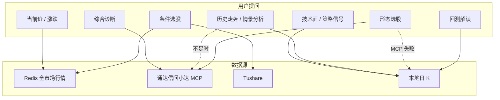

# AI 助手功能与本地 K 线关联

本文说明 zak AI 助手各功能域对**本地日 K** 的依赖程度、数据来源与降级路径。工具路由总表见 [AI 数据路由](./ai-data-routing.md)；K 线存储结构见 [数据设计](./data-design.md)。

## 核心结论

**AI 助手不要求全市场所有标的都下载本地日 K。**

系统采用分层数据源：

| 层级 | 数据源 | 典型用途 |
|------|--------|----------|
| 实时快照 | Redis 全市场行情 | 当前价、涨跌、条件选股 preset |
| 外部 MCP | 通达信问小达 | 综合诊断、形态选股全市场扫描、历史走势兜底 |
| 财务 / 宏观 | Tushare（tushare-data Skill） | 估值、财务、宏观指标 |
| **本地日 K** | VeighNa bar 存储 | 单票技术面、策略信号、回测、形态选股降级 |

**实践建议：** 优先保证**自选池 + 常分析标的 + 回测标的**有日 K；全市场日 K 仅在 MCP 不可用且需离线形态扫描时才有明显价值。

---

## 数据流概览

---

## 功能域与 K 线关联

### 总表

| 功能域 | 意图类别 | 主要工具 | K 线依赖 | 依赖范围 | 无 K 线时的行为 |
|--------|----------|----------|----------|----------|-----------------|
| 当前行情 | `quote` | `get_quote_context` | **无** | — | 使用 Redis / 看盘页实时快照 |
| K 线查询 | `quote` / `data` | `get_bars_summary`、`get_bars_data` | **强** | 单票 | 提示在数据管理页下载日 K |
| 技术面快照 | `technical` | `technical_snapshot` | **强** | 单票 | 返回 warning，引导下载日 K |
| 策略信号 | `technical` / `watchlist` | `list_strategy_signals` | **强** | 单票 | 本地 K 不足时无法计算金叉/死叉等 |
| 历史走势统计 | `technical` | `historical_pattern_summary` | **优先** | 单票 | 本地不足 → 问小达 MCP 兜底 |
| 走势情景分析 | `technical` | `trend_scenario_summary` | **优先** | 单票 | 本地不足 → MCP 补充；仍无则提示下载 |
| 综合诊断 | `diagnosis` | `diagnose_stock` | **无** | — | 完全走问小达 MCP（行情、技术、财务、资金流） |
| 条件选股 | `screening` | `screen_by_condition`、`run_recipe` | **无** | 全市场 | Redis 行情 + Tushare 合并 |
| 形态选股 | `screening` | `screen_by_pattern` | **降级** | 已下载标的 | **优先 MCP 全市场**；失败扫本地日 K（最多约 1200 只） |
| 标杆对标 | `screening` | `screen_reference_peer` | 部分 | 标杆 + 候选池 | 估值/动量以 Tushare + 行情为主 |
| 选股解读 | `screening` | `explain_screening_run` | 部分 | 结果 Top N | `batch_top_n` 技术面对比需对应标的日 K |
| 回测解读 | `backtest` | `get_backtest_result`、`list_backtest_history` | **强** | 回测标的 | 回测引擎本身依赖历史 K 线 |
| 自选管理 | `watchlist` | `get_watchlist` 等 | **无** | — | 读写 App DB 自选表 |
| 恐贪指数 | enrichment | `get_ashare_fear_greed_index` | **无** | — | 独立情绪指标，不注入 K 线上下文 |
| 财务 / 宏观 | `data` | tushare-data Skill | **无** | — | `run_python` / `read_skill_file` |

### 依赖等级说明

| 等级 | 含义 |
|------|------|
| **强** | 无本地日 K 则该功能无法产出有效结果（或只能返回 error / warning） |
| **优先** | 本地日 K 为首选；不足时自动尝试 MCP 或其他数据源 |
| **降级** | 主路径不依赖本地 K 线；仅兜底路径扫描已下载标的 |
| **部分** | 主流程不依赖；子能力（如批量技术面对比）依赖单票 K 线 |
| **无** | 与本地 K 线无关 |

---

## 按页面场景的 K 线提示

看盘页写入 AI 上下文时，会附带当前选中标的的本地日 K 覆盖情况（`build_quote_context`）：

- 有数据：`本地日 K 条数：{bar_count}`
- 无数据：`本地日 K：暂无（需先下载）`

对应页面与 AI 路由提示（`build_page_prompt`）：

| 页面 | 与 K 线相关的典型提问 | 推荐工具 |
|------|----------------------|----------|
| 自选 / 市场 / 本地 | 当前价、均线、量比、双均线信号 | `get_quote_context`、`technical_snapshot`、`list_strategy_signals` |
| 同上 | 最近走势、区间统计 | `historical_pattern_summary`（本地优先，MCP 兜底） |
| 同上 | 走势预测、支撑压力（三情景） | `trend_scenario_summary` + 按需 MCP |
| 选股 | 解读筛选结果、对比前几只技术面 | `explain_screening_run`（`batch_top_n` 需 K 线） |
| 策略回测 | 解读回测指标、策略信号状态 | `get_backtest_result`、`list_strategy_signals` |

---

## 各功能详解

### 1. 看盘 / 当前行情（不依赖 K 线）

- **工具：** `get_quote_context`
- **数据：** 看盘页选中标的的实时 `QuoteSnapshot`（涨跌、今开高低、换手率等）
- **说明：** 问「现在多少钱」「涨了多少」只需实时行情，不需要历史 K 线

### 2. 技术面与 K 线查询（强依赖单票日 K）

- **工具：** `technical_snapshot`、`get_bars_summary`、`get_bars_data`
- **计算内容：** 均线（MA5/10/20/60）、量比、区间涨跌、K 线起止日期与条数
- **最低要求：** `technical_snapshot` 至少 2 根 K 线；`list_strategy_signals` 至少 `slow_window + 5` 根（默认双均线约 25 根）
- **无数据：** 返回 `warnings: ["本地暂无足够 K 线，请先在数据管理页下载日 K"]`

### 3. 策略信号（强依赖单票日 K）

- **工具：** `list_strategy_signals`、`list_watchlist_signal_panel`
- **逻辑：** 与回测策略（如 `AshareDoubleMaStrategy`）相同的规则计算，非买卖建议
- **典型提问：** 「双均线什么状态」「有没有金叉」

### 4. 历史走势与情景分析（本地优先 + MCP 兜底）

- **工具：** `historical_pattern_summary`、`trend_scenario_summary`
- **路径：**
  1. 优先读取本地日 K 做区间统计、波动、连涨连跌等
  2. 本地不足时，`historical_pattern_summary` 经 `historical_mcp` 调用问小达 MCP
  3. MCP 仍无有效数据 → 提示下载日 K 或检查 `mcp/mcp.json`
- **合规：** 仅描述历史统计或 bull/base/bear 三情景，禁止确定性预测

### 5. 综合诊断（不依赖本地 K 线）

- **工具：** `diagnose_stock`（`tdx-stock-diagnose` Skill）
- **数据：** 问小达 MCP 一次性返回行情、技术指标、财务、资金流
- **说明：** 即使本地无 K 线，综合诊断仍可正常使用

### 6. 选股（大部分不依赖全市场 K 线）

#### 条件选股 — 无 K 线依赖

- **工具：** `screen_by_condition`、`run_recipe`、`propose_recipe`
- **数据：** 交易时段 Redis 全市场快照；非交易时段 Tushare `daily_basic` 回退
- **preset 示例：** 涨幅榜、换手率、成交量放大、低 PE、主力净流入

#### 形态选股 — MCP 优先，本地 K 降级

- **工具：** `screen_by_pattern`
- **主路径：** 问小达 MCP 全市场扫描（老鸭头、均线多头、W 底、热点活跃等）
- **降级路径：** MCP 不可用时，扫描 `load_downloaded_stocks()` 返回的**已下载日 K 标的**，上限 `MAX_PATTERN_SCAN = 1200`
- **`theme_hot`（主题投资）：** 走 Redis 行情 preset，不扫本地 K 线形态

#### 选股解读 — 部分依赖

- **工具：** `explain_screening_run`
- **说明：** 板块分布、diff 解读不依赖 K 线；若设置 `batch_top_n` 对结果前几只做技术面对比，则需对应标的本地日 K

### 7. 回测解读（强依赖回测标的日 K）

- **工具：** `get_backtest_result`、`list_backtest_history`、`list_strategy_signals`
- **说明：** 回测引擎使用本地历史 K 线驱动策略；AI 解读的是已落库的摘要指标，但信号查询仍读本地 bar

### 8. 自选 / 恐贪 / 财务（无 K 线依赖）

| 能力 | 工具 | 数据源 |
|------|------|--------|
| 自选 CRUD | `get_watchlist`、`add_to_watchlist` 等 | App DB `watchlist` 表 |
| 恐贪指数 | `get_ashare_fear_greed_index` | 独立情绪指标服务 |
| 财务 / 估值 / 宏观 | tushare-data Skill | Tushare API |

---

## 本地 K 线下载建议

### 推荐下载范围

| 优先级 | 范围 | 理由 |
|--------|------|------|
| P0 | 看盘页当前选中标的 | 上下文直接展示 K 线条数；技术面提问即时可用 |
| P0 | 自选池全部标的 | 悬浮球快捷动作、信号面板、批量关注 |
| P1 | 策略回测常用标的 | 回测与 `list_strategy_signals` 共用同一 bar 存储 |
| P2 | 常做形态离线扫描的标的 | 仅当问小达 MCP 经常不可用 |
| 非必须 | 全 A 股 5000+ | 条件选股、综合诊断、形态选股主路径均不依赖 |

### 下载入口

- **看盘页：** 「下载日K到本地」按钮（单票）
- **数据管理页（本地）：** 批量下载、覆盖检查；AI 快捷动作可调用 `get_bars_summary` 检查缺口

### 与其他数据的前置条件

| 能力 | 前置数据 | 与 K 线关系 |
|------|----------|-------------|
| 条件选股（交易时段） | Redis 行情采集 | 独立于 K 线，需先跑「行情采集」 |
| 综合诊断 / 形态 MCP | `mcp/mcp.json` 配置 tdx | 可替代大量本地 K 线需求 |
| 财务类 preset | `TUSHARE_TOKEN` | 独立于 K 线 |

---

## 意图路由与工具分组

LLM 意图分类（`IntentCategory`）决定本轮可见工具子集。与 K 线相关的分组：

| 类别 | 含 K 线工具 |
|------|-------------|
| `quote` | `get_bars_summary`、`get_bars_data` |
| `technical` | 上述 + `technical_snapshot`、`list_strategy_signals`、`historical_pattern_summary`、`trend_scenario_summary` |
| `data` | `get_bars_summary`、`get_bars_data` |
| `diagnosis` | 无（仅 `diagnose_stock`） |
| `screening` | 无直接 K 线工具（`screen_by_pattern` 内部按需读 bar） |
| `backtest` | 无直接 K 线工具（回测结果已预计算） |
| `watchlist` | 无 K 线工具（信号查询走 `list_strategy_signals` 时间接依赖） |

系统提示词约束（`packages/vnpy-llm/vnpy_llm/routing/base_prompt.py`，无工具路径经 `routing/prompts.py` 引用）：

> 若 K 线查询结果显示无本地数据，`historical_pattern_summary` 会自动尝试问小达 MCP；仍无数据时再提示下载日 K 或检查 MCP 配置。

---

## 相关代码索引

| 模块 | 路径 | 说明 |
|------|------|------|
| 看盘上下文 | `vnpy_ashare/ai/context/quote/assembly.py` | `build_quote_context` 注入 `bar_count` |
| 技术面编排 | `vnpy_ashare/services/analysis/technical.py` | `technical_snapshot`、`strategy_signals` |
| 历史走势 MCP 兜底 | `vnpy_ashare/services/analysis/historical_mcp.py` | 本地不足时问小达 |
| 形态选股降级 | `vnpy_ashare/screener/pattern/pattern_screen.py` | `MAX_PATTERN_SCAN = 1200` |
| 形态 MCP 优先 | `vnpy_ashare/integrations/mcp/pattern_screen.py` | 问小达全市场扫描 |
| 意图路由 | `vnpy_llm/routing/router.py` | `TOOL_GROUPS` 按类别过滤工具 |
| 系统提示词 | `vnpy_llm/routing/base_prompt.py`、`graph/agents/*` | 合规基座 + 各 Specialist 工具路由 |
| LangGraph 编排 | `vnpy_llm/graph/runner.py` | Supervisor → ReAct → handoff |

---

## 参见

- [AI 数据路由](./ai-data-routing.md) — 工具 / Skill / MCP 总表
- [数据设计](./data-design.md) — K 线存储、自选表、universe
- [架构说明](./architecture.md) — Service 层与 AI 上下文
- [自选策略信号区](./watchlist-signals-design.md) — 信号面板与本地 K 线计算
