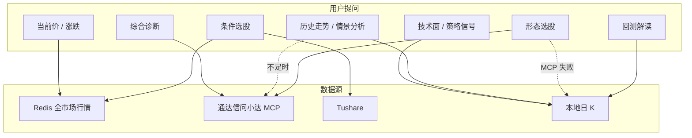

# AI 助手功能与本地 K 线关联

各功能域对**本地日 K** 的依赖程度、数据来源与降级路径。工具路由见 [AI 数据路由](./ai-data-routing.md)；存储见 [数据设计](./data-design.md)。

## 核心结论

**AI 助手不要求全市场所有标的都下载本地日 K。**

| 层级 | 数据源 | 典型用途 |
|------|--------|----------|
| 实时快照 | Redis 全市场行情 | 当前价、涨跌、条件选股 preset |
| 外部 MCP | 通达信问小达 | 综合诊断、形态选股全市场扫描、历史走势兜底 |
| 财务 / 宏观 | Tushare（tushare-data Skill） | 估值、财务、宏观指标 |
| **本地日 K** | VeighNa bar 存储 | 单票技术面、策略信号、回测、形态选股降级 |

**实践建议：** 优先保证**自选池 + 常分析标的 + 回测标的**有日 K。

## 数据流

## 功能域与 K 线关联

| 功能域 | 主要工具 | K 线依赖 | 无 K 线时的行为 |
|--------|----------|----------|-----------------|
| 当前行情 | `get_quote_context` | **无** | Redis / 看盘页实时快照 |
| K 线查询 | `get_bars_summary`、`get_bars_data` | **强** | 提示下载日 K |
| 技术面快照 | `technical_snapshot` | **强** | 返回 warning（至少 2 根 K 线） |
| 策略信号 | `list_strategy_signals` | **强** | 无法计算（默认双均线约需 25 根） |
| 历史走势统计 | `historical_pattern_summary` | **优先** | 本地不足 → 问小达 MCP |
| 走势情景分析 | `trend_scenario_summary` | **优先** | 本地不足 → MCP；仍无则提示下载 |
| 综合诊断 | `diagnose_stock` | **无** | 问小达 MCP |
| 条件选股 | `screen_by_condition`、`run_recipe` | **无** | Redis + Tushare |
| 形态选股 | `screen_by_pattern` | **降级** | MCP 全市场优先；失败扫本地已下载标的（上限 1200） |
| 标杆对标 | `screen_reference_peer` | 部分 | Tushare + 行情为主 |
| 选股解读 | `explain_screening_run` | 部分 | `batch_top_n` 技术面对比需单票 K 线 |
| 回测解读 | `get_backtest_result` | **强** | 回测引擎依赖历史 K 线 |
| 自选 / 恐贪 / 财务 | `get_watchlist`、tushare-data 等 | **无** | App DB / Tushare |

依赖等级：**强** = 无 K 线无有效结果；**优先** = 本地首选、不足降级 MCP；**降级** = 主路径不依赖、兜底扫本地；**部分** = 子能力依赖。

## 按页面场景

看盘上下文（`build_quote_context`）附带 `本地日 K 条数` 或 `暂无（需先下载）`。

| 页面 | 典型提问 | 推荐工具 |
|------|----------|----------|
| 自选 / 市场 / 本地 | 当前价、均线、双均线信号 | `get_quote_context`、`technical_snapshot`、`list_strategy_signals` |
| 同上 | 最近走势、区间统计 | `historical_pattern_summary` |
| 同上 | 走势情景（三情景） | `trend_scenario_summary` |
| 选股 | 解读结果、对比前几只技术面 | `explain_screening_run` |
| 策略回测 | 解读指标、策略信号 | `get_backtest_result`、`list_strategy_signals` |

## 下载建议

| 优先级 | 范围 |
|--------|------|
| P0 | 看盘选中标的、自选池全部标的 |
| P1 | 策略回测常用标的 |
| P2 | MCP 不可用时常做形态离线扫描的标的 |
| 非必须 | 全 A 股 5000+ |

**入口：** 看盘页「下载日K到本地」；数据管理页批量下载。

**前置条件：** 条件选股交易时段需 Redis 行情采集；综合诊断 / 形态 MCP 需 `mcp/mcp.json`；财务 preset 需 `TUSHARE_TOKEN`。

## 意图路由

`IntentCategory` 过滤可见工具。与 K 线相关：`quote` / `data` 含 `get_bars_*`；`technical` 另含 `technical_snapshot`、`list_strategy_signals`、`historical_pattern_summary`、`trend_scenario_summary`；`screening` / `diagnosis` / `backtest` 无直接 K 线工具（形态选股内部按需读 bar）。

本地无数据时，`historical_pattern_summary` 自动尝试问小达 MCP（`routing/base_prompt.py`）。
