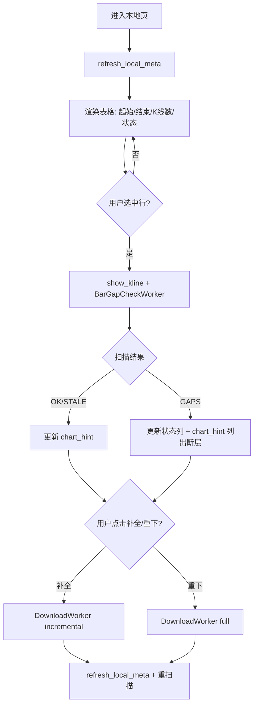

# 本地页 K 线覆盖信息设计

> 日期：2026-06-07  
> 状态：**已实现**（`bar_health.py`、`local_data_controller.py`、本地页覆盖提示与补全交互）  
> 范围：「本地」菜单页 — 展示数据起止时间、健康状态、补全/重下交互

---

## 1. 背景与目标

### 现状

- 「本地」页仅展示 **K线数** 一列（`TABLE_HEADERS_LOCAL`），无法判断数据是否过期或覆盖是否完整。
- `BarOverview`（vnpy 数据库）已提供 `start` / `end` / `count`，CLI `scripts/list_bars.py` 已在用，UI 未暴露。
- 本地页无下载/补全入口；下载仅在「自选」「市场」页通过「下载日K到本地」触发，且固定全量区间 `2020-01-01 → now`。
- 无断层检测逻辑。

### 目标

用户在「本地」页能一眼看出：

1. 每只标的 K 线的 **起始日期** 与 **结束日期**
2. 数据是否 **过期**（落后于最近交易日）
3. 选中后是否 **内部断层**（中间缺失交易日）
4. 对异常数据可 **补全到最新** 或 **重新下载**

### 非目标（本迭代不做）

- 本地页改为精简列（去掉行情列）— 保持现有表格结构，只增列
- 批量补全全部过期标的 — 后续迭代
- 分钟 K / 小时 K 覆盖检测 — 仅日 K
- 修改 vnpy 数据管理页

---

## 2. 数据模型

### 2.1 BarMeta（内存缓存）

在 `refresh_local_meta()` 中由 `get_bar_overview()` 构建：

```python
@dataclass(frozen=True)
class BarMeta:
    start: datetime
    end: datetime
    count: int
```

键：`(symbol, exchange)`，仅 `Interval.DAILY`。

替换现有 `bar_counts: dict` 为 `bar_meta: dict[tuple, BarMeta]`。

### 2.2 BarHealthStatus（列表页轻量检测）

```python
class BarHealthStatus(str, Enum):
    OK = "ok"           # 完整且最新
    STALE = "stale"     # end 早于最近交易日
    GAPS = "gaps"       # 内部断层（仅选中后精确检测才赋值）
    UNKNOWN = "unknown" # 无数据
```

列表页默认只计算 `OK` / `STALE` / `UNKNOWN`；`GAPS` 在选中行异步扫描后更新。

### 2.3 GapRange（精确断层）

```python
@dataclass(frozen=True)
class GapRange:
    start: date   # 缺失区间起始（含）
    end: date     # 缺失区间结束（含）
    missing_days: int
```

---

## 3. 健康检测规则

### 3.1 最近交易日

新增 `vnpy_ashare/calendar.py`：

```python
def last_trading_day(*, on_or_before: date | None = None) -> date:
    """返回 on_or_before（默认今天）及之前的最近 A 股交易日。"""
```

**实现策略**：

- 优先：Tushare Pro `trade_cal`（`TUSHARE_TOKEN` 或 vnpy `datafeed.password`），写入 `~/.vntrader/vnpy_zak.db` 的 `trade_calendar` 表
- 缓存有效期 7 天，覆盖范围 `[2019-01-01, 明年末]`，按需扩展
- 降级：无 token 或拉取失败时，跳过周末判定

### 3.2 过期（STALE）

```text
overview.end.date() < last_trading_day()
```

列表页对每行 O(1) 计算，无 DB 额外查询。

### 3.3 内部断层（GAPS）

**不在列表页全量扫描。** 选中行时由 `BarGapCheckWorker` 后台执行：

1. `load_bar_data(symbol, exchange, DAILY, overview.start, overview.end)`
2. 提取已有 bar 的 `datetime.date()` 集合
3. 用 `trading_days_between(overview.start.date(), overview.end.date())` 求期望交易日
4. 差集即为缺失日；连续缺失日合并为 `GapRange` 列表

若缺失日数 > 0 → 状态 `GAPS`；否则保持 `OK` 或 `STALE`。

**性能**：单标的 ~1300 根日 K，扫描 < 100ms；仅选中时触发，可接受。

### 3.4 count 粗估（可选，列表页不展示）

`count` 与期望交易日数偏差 > 5% 且非 STALE 时，列表状态列显示 `⚠️ 可能不完整`，点击选中后做精确扫描。  
**MVP 可省略**，仅依赖 STALE + 选中后 GAPS 扫描。

---

## 4. UI 设计

### 4.1 本地页表格列

在现有行情列之后，替换单一「K线数」为：

| 列名 | 内容 | 示例 |
|------|------|------|
| 起始 | `overview.start.date()` | 2020-01-02 |
| 结束 | `overview.end.date()` | 2025-06-05 |
| K线数 | `overview.count` | 1280 |
| 状态 | 图标 + 短文案 | ✅ 最新 / ⚠️ 过期 / 🔴 断层 |

状态列着色：

- `OK`：muted 绿色 `#3dd68c`
- `STALE`：警告色 `#f0b429`
- `GAPS`：下跌色 `#ff5c5c`
- `UNKNOWN`：`—`

配置变更（`quotes_config.py`）：

```python
TABLE_HEADERS_LOCAL = quote_table_headers(
    tail_headers=["起始", "结束", "K线数", "状态"]
)
```

`build_quote_row` 扩展为支持多 tail 列，或本地页专用 `_set_local_row()`。

### 4.2 工具栏按钮（仅本地页）

| 按钮 | 可见条件 | 行为 |
|------|----------|------|
| **补全到最新** | 选中且 STALE/GAPS | 增量下载 `overview.end + 1天 → now` |
| **重新下载** | 选中任意有数据行 | 全量下载 `2020-01-01 → now`（与现有 DownloadWorker 一致） |

`PageConfig` 新增：

```python
show_fill_button: bool = False
show_redownload_button: bool = False
```

「本地」页设为 `True`。

按钮默认 disabled；选中行后根据状态启用：

- 补全：STALE 或 GAPS 时 enabled
- 重新下载：有 BarMeta 时 enabled

### 4.3 图表区提示（chart_hint）

选中行后，在现有日 K 图下方显示覆盖摘要：

```text
日K：2020-01-02 ~ 2025-06-05，共 1280 根
```

状态异常时追加：

```text
⚠️ 数据过期，最新应为 2025-06-06，请点击「补全到最新」
```

或：

```text
🔴 发现 2 处断层：2024-03-15~2024-03-18、2024-08-01~2024-08-02
```

扫描进行中：`正在检查数据完整性...`

### 4.4 自选/市场页「本地」列（不变）

继续显示 `✓` / `—`，不展示起止时间（避免列过宽）。用户进入「本地」页查看详情。

---

## 5. 下载逻辑

### 5.1 扩展 DownloadWorker

```python
class DownloadWorker(QtCore.QThread):
    def __init__(
        self,
        item: StockItem,
        *,
        start: datetime | None = None,
        end: datetime | None = None,
        mode: Literal["full", "incremental"] = "full",
    ) -> None: ...
```

| mode | start | end | 说明 |
|------|-------|-----|------|
| `full` | `2020-01-01` | `now` | 现有行为；vnpy `save_bar_data` 合并写入 |
| `incremental` | `overview.end + 1 day` | `now` | 仅拉增量 |

`download_bars()` 签名不变，Worker 传入不同 `start/end`。

### 5.2 补全后刷新

1. `refresh_local_meta()`
2. `apply_filter()` 刷新表格
3. `show_kline(item)` 重绘图表
4. 重新触发 `BarGapCheckWorker`
5. 状态栏：`贵州茅台 已补全 12 根日K（2025-06-06）`

---

## 6. 模块划分

```text
vnpy_ashare/
├── calendar.py              # 新增：交易日历
├── bar_health.py            # 新增：BarMeta, 状态枚举, gap 扫描
├── bars.py                  # 不变（download_bars 复用）
└── ui/
    ├── quotes_config.py     # TABLE_HEADERS_LOCAL, PageConfig 扩展
    ├── quote_columns.py     # build_quote_row 或多 tail 支持
    ├── quotes_page.py       # 本地列渲染、按钮、hint、gap worker 挂接
    └── worker.py            # DownloadWorker 扩展, BarGapCheckWorker 新增
```

### BarGapCheckWorker

```python
class BarGapCheckWorker(QtCore.QThread):
    finished = QtCore.Signal(object)  # BarGapResult | None

@dataclass
class BarGapResult:
    item: StockItem
    status: BarHealthStatus
    gaps: list[GapRange]
    expected_days: int
    actual_days: int
```

---

## 7. 交互流程



---

## 8. 错误处理

| 场景 | 处理 |
|------|------|
| Tushare 日历不可用 | 降级周末跳过；状态栏提示「交易日历降级模式」 |
| 补全无新数据 | 状态栏「已是最新，无新增 K 线」 |
| 下载失败 | 现有 failed 信号，状态栏显示错误 |
| gap 扫描失败 | chart_hint 显示「完整性检查失败」，不影响 K 线展示 |
| 选中行切换 | 递增 generation，丢弃过期 worker 结果 |

---

## 9. 测试计划

### 单元测试（`tests/ashare/test_bar_health.py`）

- `last_trading_day` 周末/节假日（mock 日历）
- `find_gaps` 无断层、单段断层、多段断层
- `compute_list_status` STALE vs OK

### 手动测试

1. 本地页加载 → 起止日期与 `scripts/list_bars.py` 一致
2. 人为删除最近几天 K 线 → 状态变 STALE → 补全成功
3. 人为删除中间段 → 选中后显示断层区间 → 补全后断层消失
4. 重新下载 → 数据与全量一致
5. 自选页「本地」列仍为 ✓/—

---

## 10. 实施步骤（预估 1 PR）

1. `calendar.py` + `bar_health.py`（纯逻辑 + 测试）
2. `DownloadWorker` 增量模式
3. `quotes_config` / 表头 / `refresh_local_meta` 扩展
4. `quotes_page` 本地页 UI（列、按钮、hint、worker 挂接）
5. 手动验证 + 文档更新 `product-plan.md` 本地页描述（一行）

---

## 11. 后续迭代（不在本 PR）

- 批量补全：工具栏「补全全部过期」
- AI 上下文：`get_bars_summary` 含起止与状态
- 调度任务：定时增量补全自选池
- 本地页精简列：隐藏无意义的行情列，改为代码/名称/覆盖信息专用布局
