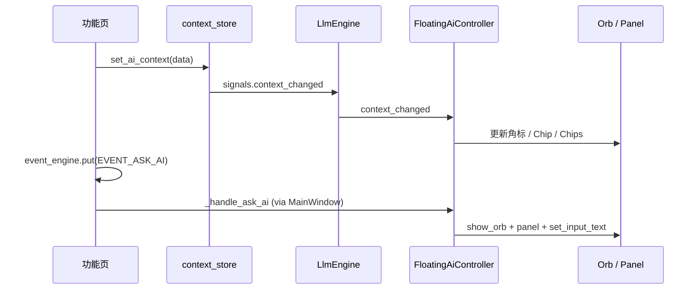

# 悬浮球功能增强 — 技术设计

> 版本：v0.2 · 2026-06-09  
> 状态：Phase 1–3 已全部实现  
> 关联：[架构说明](../../architecture.md) · [AI 数据路由](../../ai-data-routing.md) · [AI 能力重构设计](./2026-06-08-ai-refactor-design.md)

---

## 1. 背景与目标

### 1.1 背景

zak 终端已将 AI 助手拆为两种形态：

| 形态 | 组件 | 适用场景 |
|------|------|----------|
| **悬浮球 + 精简面板** | `FloatingAiOrb` / `FloatingAiPanel` | 边看盘/选股边短问 |
| **全屏 AI 助手** | `AiPageWidget` | 长对话、回测解读、会话管理 |

当前悬浮球已具备：拖拽定位、右键菜单、页面白名单、与 `EVENT_ASK_AI` 联动。但**尚未**与业务上下文深度绑定，用户不知道「球知道自己在看哪只股票」，高频操作仍依赖手动输入或页面内按钮。

### 1.2 目标

1. **上下文可见**：悬浮球/面板实时反映当前页、选中标的、任务状态（选股结果数等）。
2. **场景化入口**：按页面提供 Quick Actions（chips / 右键菜单），降低 prompt 编写成本。
3. **架构解耦**：悬浮球逻辑从 `AshareMainWindow` 抽离为独立协调层，便于测试与扩展。
4. **与全屏 AI 分工清晰**：悬浮球负责「轻量、就地」；全屏负责「长会话、回测解读（新会话）」。

### 1.3 非目标（本期不做）

- 悬浮球跨窗口 / 系统级置顶（仍为 centralWidget 子控件）
- 悬浮球内嵌完整会话侧栏（全屏页已有 `AiSessionSidebar`）
- LLM 自动执行买卖、自动跑回测（须用户确认，沿用现有 Event 确认流）
- 改造 `SkillEngine` / `McpEngine` 核心逻辑

---

## 2. 现状盘点

### 2.1 代码结构（已实现）

```text
vnpy_ashare/ui/main_window.py
  ├── _FLOATING_ORB_PAGE_KEYS     # watchlist | market | local | screener
  ├── _init_floating_ai()         # 创建 orb + panel
  ├── _sync_floating_orb_for_page # 按页显隐
  ├── _handle_ask_ai()            # EVENT_ASK_AI 路由
  └── _toggle_floating_orb()      # Ctrl+L

vnpy_llm/ui/floating_panel.py
  ├── FloatingAiOrb               # 绘制、拖拽、右键菜单
  └── FloatingAiPanel             # 精简标题栏 + AiChatPanel(floating=True)

vnpy_llm/ui/panel.py
  └── AiChatPanel(floating=True)  # 无顶栏、2 行输入、↑ 发送

vnpy_ashare/ai/context_store.py
  └── set_ai_context / get_ai_context / set_screening_results / sync_backtest_summary_dict / ...

vnpy_ashare/events.py
  └── AskAiRequest(prompt, source_page, use_full_page, new_session)
```

### 2.2 页面白名单（已实现）

| 页面 key | 显示悬浮球 | 上下文写入方 |
|----------|-----------|-------------|
| `watchlist` | ✅ | `QuotesPage._emit_ai_context()` |
| `market` | ✅ | 同上 + `set_market_quotes_cache()` |
| `local` | ✅ | 同上 |
| `screener` | ✅ | `sync_screener_page_context()` |
| `cta_backtest` | ❌ | `sync_backtest_page_context()`；问 AI → 全屏 + `new_session` |
| `batch_backtest` | ❌ | `sync_batch_compare_context()` |
| `data_manager` | ❌ | 未接入 |
| `ai_assistant` | ❌ | 与全屏互斥 |

用户手动隐藏（右键 / Ctrl+L）后，`_orb_user_hidden=True`，切回白名单页不自动弹出，直至用户再次 `Ctrl+L`。

### 2.3 已有集成 API

**上下文桥接（同步，无 Event；业务页经 Service 写入，底层 `context_store`）：**

```python
# vnpy_ashare/ai/context_store.py（只读侧 / 无 Engine 时的回退）
set_ai_context(AiContextData)
set_screening_results(...)
sync_backtest_summary_dict(...)
set_diagnose_result(...)

# 推荐：经 Service
# QuoteService.publish_quote_context()
# BacktestService.persist_summary()
# ScreeningService.publish_page_context()
```

**打开 AI（异步 Event → MainWindow Signal）：**

```python
# vnpy_ashare/events.py
event_engine.put(Event(EVENT_ASK_AI, AskAiRequest(
    prompt="...",
    source_page="自选",
    use_full_page=False,   # False → 悬浮面板；True → 全屏页
    new_session=False,     # True → 回测问 AI 新建会话
)))
```

**LLM 读上下文：**

```python
# vnpy_llm/engine.py → build_api_messages()
ctx = get_ai_context()
page_prompt = build_page_prompt(ctx.page)  # vnpy_llm/prompts.py
```

### 2.4 缺口

| 缺口 | 影响 |
|------|------|
| `set_ai_context` 后不通知 UI | 悬浮面板无法展示 Context Chip |
| `AiContextData` 无 `actions` / `badge` | 无法动态生成快捷菜单 |
| 协调逻辑散落在 `main_window` | 难测、难扩展 |
| 无页面级 Quick Chips | 用户需完整输入问题 |
| `architecture.md` 仍写「侧栏 Dock」 | 文档与实现不一致 |

---

## 3. 目标架构

### 3.1 分层

```text
┌─────────────────────────────────────────────────────────┐
│  AshareMainWindow                                        │
│    页面切换 / Event 注册 / 薄委托                          │
└───────────────────────────┬─────────────────────────────┘
                            │
┌───────────────────────────▼─────────────────────────────┐
│  FloatingAiController（新增）                            │
│    · 页面白名单与显隐策略                                  │
│    · orb / panel 生命周期                                 │
│    · 订阅 context_changed，驱动角标与 Chips               │
│    · 组装页面级 QuickAction 列表                          │
│    · 处理 AskAiRequest 路由                               │
└───────┬───────────────────────────────┬─────────────────┘
        │                               │
┌───────▼──────────┐         ┌──────────▼──────────┐
│ FloatingAiOrb    │         │ FloatingAiPanel      │
│ · 角标 badge     │         │ · ContextChip        │
│ · 右键动态菜单    │         │ · QuickActionChips   │
└──────────────────┘         │ · AiChatPanel        │
                             └──────────┬───────────┘
                                        │
                             ┌──────────▼──────────┐
                             │ LlmEngine            │
                             │ SkillEngine + MCP    │
                             └──────────┬──────────┘
                                        │
                             ┌──────────▼──────────┐
                             │ context_store        │
                             │ 各 Service / 页写入   │
                             └─────────────────────┘
```

**建议文件：**

```text
vnpy_llm/ui/floating_controller.py   # FloatingAiController
vnpy_llm/ui/floating_actions.py      # QuickAction 定义与页面映射
vnpy_llm/ui/floating_panel.py          # Orb / Panel 视图（已有，扩展）
```

### 3.2 数据流



---

## 4. 核心数据模型

### 4.1 扩展 `AiContextData`

```python
# vnpy_ashare/ai/context.py

@dataclass
class QuickAction:
    """悬浮球/面板可点击的快捷动作。"""
    id: str              # 稳定标识，如 "diagnose"
    label: str           # 展示文案，如 "综合诊断"
    prompt: str          # 填入输入框的文本（可含占位符）
    auto_send: bool = False  # 是否点击后直接发送

@dataclass
class AiContextData:
    page: str = ""
    symbol: str = ""
    exchange: str = ""
    name: str = ""
    quote_summary: str = ""
    extra: str = ""
    # --- 新增 ---
    badge: str = ""                          # 角标短文案：「自选」「选股·30」
    actions: list[QuickAction] = field(default_factory=list)
```

### 4.2 页面 QuickAction 注册表

```python
# vnpy_llm/ui/floating_actions.py

PAGE_QUICK_ACTIONS: dict[str, list[QuickAction]] = {
    "自选": [
        QuickAction("diagnose", "综合诊断", "..."),
        QuickAction("technical", "技术形态", "..."),
        QuickAction("add_watchlist", "加入自选", "..."),  # 仅非自选池标的时显示
    ],
    "市场": [...],
    "本地": [...],
    "选股": [
        QuickAction("interpret_screen", "解读选股结果", "..."),
        QuickAction("filter_bank", "筛出银行股", "..."),
    ],
}
```

页面 `activate()` / 选中变化时：

1. 调用既有 `build_quote_context()` / `sync_screener_page_context()`
2. 由 helper `enrich_context_with_actions(data) -> AiContextData` 填充 `badge` + `actions`
3. `set_ai_context(enriched)`

### 4.3 扩展 `AskAiRequest`（可选，Phase 2）

```python
@dataclass
class AskAiRequest:
    prompt: str
    source_page: str = ""
    use_full_page: bool = False
    new_session: bool = False
    auto_send: bool = False      # 预填后自动发送
    action_id: str = ""          # 来自 QuickAction，便于埋点
```

---

## 5. UI 规格

### 5.1 悬浮球 `FloatingAiOrb`

```text
        ┌─────────┐
        │ ✦    [自]│  ← 右上 badge（page 缩写或「选股·N」）
        │  AI orb │
        └─────────┘
```

| 交互 | 行为 |
|------|------|
| 左键 | 展开/收起精简面板 |
| 右键 | 固定项 + `context.actions` 动态项 |
| 拖拽 | 移动并 `QSettings` 持久化 `orb_position` |
| 悬停 | 高亮 + tooltip 展示 `AiContextData` 摘要 |
| Ctrl+L | 白名单页切换显隐；非白名单提示不可用 |

**右键菜单结构：**

```text
打开对话
─────────────
〔动态 QuickAction 列表，最多 5 项〕
─────────────
全屏模式
历史会话…
AI 工具能力…
─────────────
隐藏悬浮球
```

### 5.2 精简面板 `FloatingAiPanel`

```text
┌─ ⠿ AI ─────────────── ⛶ — ┐
│ [自选] 贵州茅台  1688.00 +2.3% │  ← ContextChip（可点击复制 vt_symbol）
├──────────────────────────────┤
│ 消息区（流式，已有）           │
├──────────────────────────────┤
│ [综合诊断] [技术形态]          │  ← QuickActionChips（横向滚动）
├──────────────────────────────┤
│ 问点什么…                 ↑ │
└──────────────────────────────┘
```

| 控件 | 说明 |
|------|------|
| ContextChip | 只读；数据来自 `get_ai_context()`；无选中标的时仅显示页名 |
| QuickActionChips | 点击 → `set_input_text(prompt)` 或 `auto_send` |
| ⛶ | `expand_requested` → 全屏 AI 页 |
| — / Esc | `panel_minimized` → 仅隐藏面板，保留球 |

### 5.3 与全屏 AI 的分工（双轨会话，已实现）

悬浮（`floating`）与全屏（`assistant`）各记一条 `session_id`，持久化于 `QSettings("vnpy_zak", "llm_sessions")`。

| 场景 | 入口 | 会话策略 |
|------|------|----------|
| 看盘短问 | 悬浮球 / chips | 恢复 **floating** 上次会话 |
| 综合诊断 | 看盘按钮 / chip | 悬浮面板，floating 会话 |
| 选股解读 | 选股侧栏「问 AI」 | 悬浮面板，floating 会话 |
| 回测解读 | 回测页「问 AI」 | **assistant + `new_session=True`** |
| 长对话 / 会话管理 | 全屏 / 球右键「全屏」 | 恢复 **assistant** 上次会话 |
| 悬浮新建 | 球右键 / 面板「＋」 | `new_session(surface=floating)` |

---

## 6. 页面集成规范

### 6.1 各页职责

| 页面 | 何时写 context | badge 示例 | 建议 actions |
|------|---------------|-----------|--------------|
| 自选 | 选中变化、activate | `自选` | 综合诊断、技术形态 |
| 市场 | 同上 | `市场` | 综合诊断、板块概览（后续） |
| 本地 | 同上 | `本地` | 综合诊断、数据健康（后续） |
| 选股 | 跑完筛选、activate | `选股·{n}` | 解读结果、二次筛选 |

### 6.2 集成 Checklist（新功能页）

```text
□ activate() 时 sync context
□ 核心状态变化时更新 context（选中标的、任务完成）
□ 高频 AI 入口优先发 EVENT_ASK_AI，不直接操作 panel 控件
□ prompt 使用 build_*_ai_prompt()，写明应调用的工具名
□ 写操作（加自选、填选股）走确认流（FillScreenerRequest 等）
□ 不在 LLM/Worker 线程直接操作 Qt（EventEngine + Signal）
```

### 6.3 工具路由（不变）

悬浮球与全屏共用 `LlmEngine` + Skills/MCP，路由见 [AI 数据路由](../../ai-data-routing.md)。**关键是 context 写对**，使 `build_page_prompt(page)` 与工具选择一致。

---

## 7. `FloatingAiController` 接口草案

```python
class FloatingAiController(QtCore.QObject):
    """悬浮球协调层：由 AshareMainWindow 持有。"""

    def __init__(self, main_window, llm_engine: LlmEngine) -> None: ...

    # --- 生命周期 ---
    def init(self, shell: QtWidgets.QWidget) -> bool: ...
    def on_page_changed(self, page_key: str) -> None: ...
    def on_window_resize(self) -> None: ...

    # --- 用户操作 ---
    def toggle_orb(self) -> None: ...
    def handle_ask_ai(self, data: AskAiRequest) -> None: ...
    def open_fullscreen(self) -> None: ...

    # --- 上下文 ---
    def _on_context_changed(self) -> None: ...
    def _refresh_chrome(self) -> None: ...  # badge + chip + chips + menu
```

`AshareMainWindow` 收敛为：

```python
def _show_page(self, index):
    ...
    self._floating_controller.on_page_changed(entry.key)

def _handle_ask_ai(self, data):
    self._floating_controller.handle_ask_ai(data)
```

---

## 8. 上下文通知链路（已实现）

`set_ai_context()` 通过 `register_context_listener` 回调 → `LlmEngine.signals.context_changed` → `FloatingAiController.refresh_context`。

---

## 9. 分阶段实施计划

### Phase 1 — 上下文可见（预估 1–2 天）

| 任务 | 文件 |
|------|------|
| `set_ai_context` 后触发 `context_changed` | `context_store.py`, `engine.py` |
| 面板 ContextChip | `floating_panel.py` |
| orb tooltip / badge 显示页名 | `floating_panel.py` |
| `enrich_context_with_actions` 硬编码映射 | `floating_actions.py` |
| 更新 `architecture.md` 悬浮球描述 | `docs/architecture.md` |

**验收：** 自选选中茅台 → 球 tooltip 与面板 Chip 显示标的；切到回测 → 球隐藏。

### Phase 2 — 快捷动作（预估 2–3 天）

| 任务 | 文件 |
|------|------|
| QuickActionChips 组件 | `floating_panel.py` 或独立 widget |
| 右键菜单注入动态 actions | `FloatingAiOrb` |
| 各页 activate 写入 actions | `quotes_page.py`, `screener_context.py` |
| 抽出 `FloatingAiController` | 新文件 + 精简 `main_window.py` |
| `AskAiRequest.auto_send` | `events.py`, `panel.py` |

**验收：** 点击「综合诊断」chip → 输入框预填 diagnose prompt；选股页显示「解读结果」。

### Phase 3 — 感知与闭环（已实现）

| 任务 | 状态 | 说明 |
|------|------|------|
| 选股完成角标动画 | ✅ | `EVENT_ORB_ATTENTION` → `notify_attention` → `play_attention_pulse`，不弹面板 |
| `orb_user_hidden` 持久化 | ✅ | `QSettings("vnpy_zak", "floating_ai")` |
| 数据管理页 context | ✅ | `data_manager_context.py` + `manager_widget.refresh_tree` |
| 会话场景标签 | ✅ | `sessions.scene` + 历史列表副标题 |
| 页面 Quick Action 扩展 | ✅ | 市场「板块概览」、本地「数据健康」、非自选「加入自选」 |
| `AskAiRequest.action_id` | ✅ | 埋点预留字段 |
| `EVENT_AI_ACTION` | ✅ | 统一入口 `put_ai_action`，内部分发至既有 handler |

---

## 10. 持久化与配置

| Key | 存储 | 说明 |
|-----|------|------|
| `vnpy_zak/floating_ai/orb_position` | `QSettings` | 已有 |
| `vnpy_zak/floating_ai/panel_geometry` | `QSettings` | 已有 |
| `vnpy_zak/floating_ai/orb_user_hidden` | `QSettings` | 跨会话记住用户隐藏偏好 |

---

## 11. 测试计划

### 11.1 单元测试

```text
tests/llm/ui/test_floating_actions.py
  - enrich_context_with_actions 各页 actions 数量与 id
  - badge 格式化（选股结果数）

tests/llm/ui/test_floating_controller.py
  - on_page_changed 白名单内外显隐
  - _orb_user_hidden 与 sync 行为
```

### 11.2 手动验收

| # | 步骤 | 期望 |
|---|------|------|
| 1 | 启动 → 自选页 | 悬浮球可见 |
| 2 | 选中标的 | Chip 更新 |
| 3 | 切到策略回测 | 球与面板隐藏 |
| 4 | 切回自选 | 球恢复（未手动隐藏时） |
| 5 | Ctrl+L 隐藏 → 切页再回 | 仍隐藏 |
| 6 | 选股完成 → 问 AI | 面板打开且 prompt 正确 |
| 7 | 回测问 AI | 全屏新会话，非悬浮球 |

---

## 12. 风险与约束

| 风险 | 缓解 |
|------|------|
| `main_window` 与悬浮球循环依赖 | 引入 `FloatingAiController` 单向依赖 |
| context 更新频繁导致 UI 抖动 | Chip 仅在 symbol/page/badge 变化时刷新 |
| QuickAction prompt 与工具名漂移 | 集中 `floating_actions.py` + 单测快照 |
| 非白名单页 `EVENT_ASK_AI` | 已有：跳转自选再开球；可按 `source_page` 智能跳页 |
| 线程安全 | 保持 EventEngine → Signal → GUI 线程模式 |

---

## 13. 文档与后续

- 评审通过后，更新 [architecture.md](../../architecture.md) § AI 助手交互
- Phase 1 开工前可拆 [实现计划](../plans/2026-06-08-floating-orb-enhancement-plan.md)（待写）
- 产品侧交互原型可参考本文 §5；视觉细节遵循 `FLOATING_CHAT_STYLESHEET`

---

## 附录 A：事件与页面对照

| Event | 悬浮球行为 |
|-------|-----------|
| `EVENT_ASK_AI` + `use_full_page=False` | 白名单页：开球+面板；否则跳自选 |
| `EVENT_ASK_AI` + `use_full_page=True` | 隐藏球，开全屏 |
| `EVENT_OPEN_BACKTEST` | 无直接影响（切页后隐藏） |
| `EVENT_FILL_SCREENER` | 切选股页，球由 sync 显示（建议经 `EVENT_AI_ACTION` 投递） |
| `EVENT_AI_ACTION` | 统一 AI 写操作入口，分发至 fill_screener / ask_ai / open_backtest 等 |

## 附录 B：关键文件索引

| 路径 | 职责 |
|------|------|
| `vnpy_ashare/ui/main_window.py` | 页面切换、Event 注册、悬浮球委托 |
| `vnpy_llm/ui/floating_panel.py` | Orb / Panel 视图 |
| `vnpy_llm/ui/panel.py` | `AiChatPanel(floating=True)` |
| `vnpy_ashare/ai/context.py` | `AiContextData` 模型 |
| `vnpy_ashare/ai/context_store.py` | 终端共享内存（AI 上下文、回测/选股缓存） |
| `vnpy_ashare/events.py` | `AskAiRequest` |
| `vnpy_llm/engine.py` | 对话、工具编排、context 注入 prompt |
| `vnpy_llm/prompts.py` | `build_page_prompt` 分页提示 |
