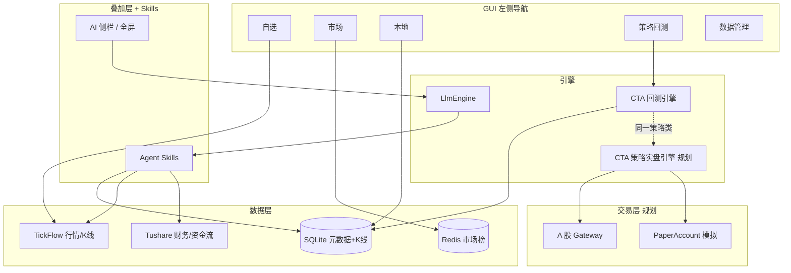

# A 股产品方案（回测 + 看盘 + AI + 选股 + 策略实盘）

本文档是 vnpy_zak 的**产品北极星**：专注 **A 股现货**，覆盖投研到实盘闭环；**不包含期货 CTP**。技术细节见 [architecture.md](./architecture.md)，策略实盘实现见 [roadmap.md](./roadmap.md) P3–P4。

---

## 1. 定位

**一句话**：个人 A 股量化终端 —— 选股 → 看盘 → 回测验证 → **同一套策略 A 股实盘** → AI 串联解读。

| 支柱 | 用户问题 | 核心能力 |
|------|----------|----------|
| **看盘** | 今天看什么、走得怎样 | 自选 / 市场 / 本地 K 线、五档、调度 |
| **回测** | 策略历史上行不行 | 策略回测 + `AShareTemplate`（T+1、整手） |
| **选股** | 从全市场筛出候选 | Tushare 因子 + 规则引擎 + 入自选 |
| **AI** | 自然语言问票、解图、解回测 | 上下文 + 工具调用（读行情/K 线/选股结果） |
| **策略实盘** | 策略能否自动跑 A 股 | A 股 Gateway + `AShareTemplate` + CTA 策略（**远期，见 roadmap P3**） |

### 策略生命周期（目标闭环）

```text
选股入池 → 看盘跟踪 → 策略回测验证 → 模拟盘（PaperAccount）→ A股策略实盘
         ↑_________________同一策略类（如 AshareDoubleMaStrategy）_________________↓
```

**当前状态（2026-06）**：**看盘 / 回测 / 选股 / AI** 四支柱投研闭环已打通，为当前交付范围。

**远期备忘（暂无近期计划）**：A 股策略实盘、PaperAccount 模拟盘、Gateway 看盘行情 — 见 [roadmap.md](./roadmap.md) P3–P4，保留设计供日后参考。

**明确不做**：期货 CTP / SimNow、用 vnpy 默认 Trader 布局替换自建看盘页。

---

## 2. 总体架构



原则：**看盘与回测 UI 已自建；选股与 AI Skills 已落地；AI 读数据、不替代规则引擎。策略实盘为远期路线，近期不排期。**

---

## 3. 数据分工（最优且清晰）

| 数据 | 来源 | 用途 |
|------|------|------|
| 实时/历史行情、日分钟 K | **TickFlow** | 看盘、下 K、回测主数据 |
| 财务、资金流、估值、行业 | **Tushare** | 选股因子（非 GUI 主行情） |
| 自选池、全市场列表、选股结果 | **SQLite** `~/.vntrader/vnpy_zak.db` | 元数据 |
| 本地 K 线 | **SQLite** `database.db` | 回测、本地页 |
| 涨幅榜快照 | **Redis** + collector | 市场页（可选，非核心路径） |

避免让 AI 或选股模块直接「编造」行情；数值一律来自上述数据源。

---

## 4. 四支柱最优路径

### 4.1 看盘（已实现，维护增强）

**现状**：自选 TickFlow、市场 Redis、图表/五档/调度 —— 已是正确方向。

**当前状态**：

- [x] 自选页直连 TickFlow 行情
- [x] 市场页 Redis 涨幅榜 + TickFlow 直连刷新（`TickFlowStreamBridge`）
- [x] 分 K 图表（1 分/5 分/日 K）
- [x] 五档盘口（TickFlow WS）
- [x] 定时刷新调度（`refresh_scheduler`）
- [x] 本地页 K 线健康检测与缺口补全（`bar_health`）
- [ ] 自选页工具栏「AI」图标（等同 `Ctrl+L`，可选）
- [ ] 状态栏显示行情源（TickFlow / Redis；P4 后含 Gateway）

**实盘阶段（远期 P4）**：若日后启动 P3，看盘可切换为 Gateway 行情主源。

---

### 4.2 回测（深化 A 股，不扩期货）

**现状**：`AshareDoubleMaStrategy` + 策略回测页 + 自动 A 股默认参数；Widget 过滤仅展示 `AShareTemplate` 子类。

**交互与数据分阶段规格**：见 [backtest-ux.md](./backtest-ux.md)。

**进度**（详见 [backtest-ux.md](./backtest-ux.md)）：

| 优先级 | 项 | 状态 | 说明 |
|--------|-----|------|------|
| **B1** | 看盘 → 策略回测联动 | ✅ | 自选/市场/本地选中 → 跳转并预填 `vt_symbol` |
| **B2** | 批量回测对比 | ✅ | 自选 / 选股「批量回测」→「回测对比」页；`batch_watchlist` / `batch_screener` |
| **B3** | 回测结果摘要 | ✅ | `backtest/run_store.py` + `BacktestService.persist_summary()` |
| **B4** | 回测页 AI 上下文 | ✅ | `ai/backtest_context.py` + `context_store` |
| P2 | 更多 `AShareTemplate` 示例策略 | 持续 | 突破、RSI 等，仍只做多 |
| B5 | 分钟回测 | 远期 | 依赖 TickFlow 分钟 K 本地量 |

**与实盘关系（远期）**：回测通过的 `AShareTemplate` 子类，设计上可直接作为 CTA 策略模块的实盘策略类；若日后启动 P3，与回测共用同一套代码。

---

### 4.3 选股（已实现，含 GUI 选股页）

选股模块已完整实现：`vnpy_ashare/screener/`（13 个文件）提供因子封装、规则引擎、方案持久化、Tushare 数据接入；`screener_page.py` 提供左侧导航「选股」页；`ScreeningService` + `vnpy_screening_skill.py` + AI 上下文已贯通。

#### 分层设计

```text
Layer 1  规则引擎（已实现）
         factors.py（Tushare 字段封装）+ rules.py（可组合筛选条件）
         + runner.py（执行选股）+ tushare_client.py（Tushare 数据源）
Layer 2  模板 / 保存方案（已实现）
         presets.py（内置方案：低PE、高ROE、主力净流入等）
         + scheme_store.py（方案持久化）+ draft_store.py（草稿）
Layer 3  AI 增强（已实现）
         nl_mapper.py（自然语言 → 规则参数解析）
         screener_context.py（AI 上下文共享）
         vnpy_screening_skill.py（AI 工具调用）
```

#### 已实现结构

```text
vnpy_ashare/screener/
├── factors.py           # Tushare 字段封装
├── rules.py             # 可组合筛选条件
├── runner.py            # 执行选股、写 DB
├── presets.py           # 内置方案
├── scheme_store.py      # 方案持久化（JSON）
├── draft_store.py       # 草稿保存
├── run_store.py         # 运行记录
├── batch_actions.py     # 批量操作（加入自选等）
├── export.py            # CSV 导出
├── tushare_client.py    # Tushare 数据源
├── quotes_loader.py     # 行情加载
└── nl_mapper.py         # 自然语言 → 规则参数

vnpy_ashare/ui/
├── screener_page.py             # 选股页 GUI
├── screener_batch_dialog.py     # 批量导入自选
├── screener_confirm_dialog.py   # 确认对话框
└── screener_run_sidebar.py      # 运行侧边栏

vnpy_ashare/services/screening_service.py    # ScreeningService
skills/vnpy_screening_skill.py               # 选股 Skill
scripts/run_screener.py                      # CLI 选股

#### 与用户流程

```text
选股页设定条件 → 运行 → 结果表（代码/名称/关键因子）
    → 勾选 → 加入自选（batch_actions）
    → 选中 → 跳转自选看盘 / 问 AI
    → 可选：对结果批量下载日 K → CTA 回测
```

#### 数据依赖

- `.env` 中 `TUSHARE_TOKEN`（已有占位）
- 全市场列表：`sync_universe` 已有，选股结果与之 join

---

### 4.4 AI 增强（服务三业，而非第四套 UI）

**现状**：侧栏 Dock、全屏、`vnpy_llm` 插件化；**P2 已落地**：多会话 UI、流式停止、LLM 配置热重载（设置页 + 面板菜单）。

**上下文存储**：终端共享状态在 `vnpy_ashare/ai/context_store.py`（线程安全内存）。各页经 **Service** 写入（如 `QuoteService.publish_quote_context()`、`BacktestService.persist_summary()`）；Skills / LLM 只读可直接访问 `context_store`。

**核心 Skill：**

| Skill 文件 | 能力 |
|------------|------|
| `skills/vnpy_context_skill.py` | 终端上下文（当前自选、K 线概览） |
| `skills/vnpy_data_skill.py` | 行情/K 线数据查询 |
| `skills/vnpy_backtest_skill.py` | 回测执行与结果读取 |
| `skills/vnpy_screening_skill.py` | 选股筛选 |
| `skills/vnpy_watchlist_skill.py` | 自选池管理 |
| `skills/vnpy_analysis_skill.py` | 技术面快照、综合诊断、研报聚合 |

**工具调用（由 Agent Skills 提供）：**

| 工具 | 作用 |
|------|------|
| `get_quote_context` | 当前选中标的行情摘要（经 `QuoteService` → `context_store`） |
| `get_bars_summary` | 本地 K 线条数、区间涨跌 |
| `get_bars_data` | 获取指定标的最近 N 根 K 线 OHLCV 数据 |
| `get_watchlist` | 自选列表 |
| `run_screener` | 执行已保存选股方案，返回 Top N |
| `get_backtest_summary` | 最近一次回测指标 |
| `diagnose_stock` | 综合诊断（技术面 + 研报聚合） |
| `technical_snapshot` | 技术指标快照（均线/RSI/MACD 等） |

交互示例：

- 看盘时：「这只票最近 20 日形态如何？」→ 读 K 线摘要回答
- 选股后：「筛出的 30 只里哪些偏银行？」→ 读选股结果 + 行业字段
- 回测后：「和大盘比怎么样？」→ 读 `BacktestService` 落库摘要

**Agent Skills** 体系：通过 `vnpy_skills/` 引擎注册业务 Skill，每个 Skill 以 `SkillTemplate` 子类暴露工具函数供 LLM 调用。

**原则**：

- LLM **不执行**买卖建议；**不编造**价格
- 选股 **默认走规则引擎**；AI 可建议条件，用户确认后再跑

---

## 5. 左侧导航（当前态）

```text
自选 | 市场 | 本地 | 选股 | 策略回测 | 回测对比 | 数据管理 | AI 助手
（远期：CTA 策略 · 交易监控 · 交易 Dock — roadmap P3，暂无近期计划）
```

| 页 | 心智 |
|----|------|
| 自选 | 我的池子，深度跟踪；支持 **批量回测** 整池对比 |
| 市场 | 全市场发现、涨幅榜 |
| 本地 | 已下载 K 线健康状态 |
| 选股 | 多因子筛选、方案保存、批量入自选、勾选 **批量回测** |
| 策略回测 | 历史验证策略（单标的） |
| 回测对比 | 批量回测批次列表与指标对比表 |
| 数据管理 | vnpy 数据维护 |

**选股** 页：已实现，含规则筛选、AI 自然语言解析、批量导入自选等功能。  
**CTA 策略** 页（vnpy `CtaManager`）：**当前未挂载**；若远期启动 P3，再恢复 `CtaStrategyApp` 与 Gateway 接入。

AI：**不进主导航**，保持 `Ctrl+L` / `⌘L` 叠加层（方案 B）。

---

## 6. 实施优先级

### 迭代 1–3：投研闭环 ✅ 已完成

见上文 §4 各节；迭代 3 含 NL 选股解析（`nl_mapper.py`）、Service 层与 `context_store` 统一。

### 迭代 4：A 股策略实盘 📋 远期（roadmap P3–P4，暂无近期计划）

设计备忘，见 [roadmap.md](./roadmap.md)：

1. 接入 **A 股 Gateway**（XTP / 华鑫奇点 / OST 等，按券商选型）
2. **PaperAccount** 本地模拟：Gateway 行情 + 本地撮合
3. 交易 Dock（`TradingWidget`）+ 「交易监控」页
4. **CTA 策略** 页：与回测共用 `AShareTemplate`
5. `GatewayQuoteProvider`：看盘与策略共用券商 Tick（P4）

## 7. 技术约束（保持简单）

1. **一套 A 股模型**：继续 `StockItem` + `QuoteSnapshot`，不引入期货合约逻辑  
2. **策略只做多**：`AShareTemplate` 统一 T+1、100 股  
3. **选股可复现**：条件 JSON 存盘，同条件同结果  
4. **AI 可审计**：工具调用打日志，回答引用数据来源  
5. **包边界**：`vnpy_llm` 通用；`vnpy_skills` 为 AI 工具引擎；`vnpy_mcp` 为远端工具集成  

---

## 8. 成功标准

### 阶段 A（投研闭环，迭代 1–3）

- [x] 用户用 **选股页** 从全市场筛出列表并 **一键入自选**  
- [x] 自选 / 选股标的 **批量回测** 同一策略并在 **回测对比** 页对比  
- [x] 看盘时 **AI** 能基于 **真实行情/K 线摘要** 回答，无幻觉价格  

### 阶段 B（策略实盘，迭代 4 — 远期，暂无近期计划）

- [ ] 回测通过的 `AShareTemplate` 策略可在 **CTA 策略** 页加载运行  
- [ ] **PaperAccount** 下完成至少一次模拟盘自动交易闭环  
- [ ] 接入目标券商 **A 股 Gateway** 后，支持实盘或券商仿真账号  
- [ ] 实盘时策略行情与下单 **同源**（Gateway Tick）  

---

## 9. A 股策略实盘要点（远期备忘，非期货）

| 项 | 说明 |
|----|------|
| 接口 | A 股现货 Gateway，**不是** CTP / SimNow |
| 策略 | `vnpy_ctastrategy` + `AShareTemplate`（T+1、100 股、只做多） |
| 模拟 | `vnpy_paperaccount` + Gateway 行情，本地撮合 |
| UI | 增量叠加：交易 Dock + CTA策略页 + 交易监控页，不替换看盘页 |
| 行情 | 研究：TickFlow；实盘：Gateway 优先（TickFlow 降级备用） |

---

## 10. 与 roadmap 的对应

| 文档阶段 | 内容 |
|----------|------|
| 迭代 1–3（product-plan） | 选股、批量回测、AI Skills、P2 增强 | ✅ |
| P3（roadmap） | A 股 Gateway、PaperAccount、CTA 策略实盘、交易 Dock | 📋 远期 |
| P4（roadmap） | 看盘页 `GatewayQuoteProvider` | 📋 远期 |
| 不在范围 | 期货 CTP、默认 Trader 全屏布局 | — |

投研闭环为当前交付范围；P3–P4 保留在路线图中，**暂无近期实施计划**。
