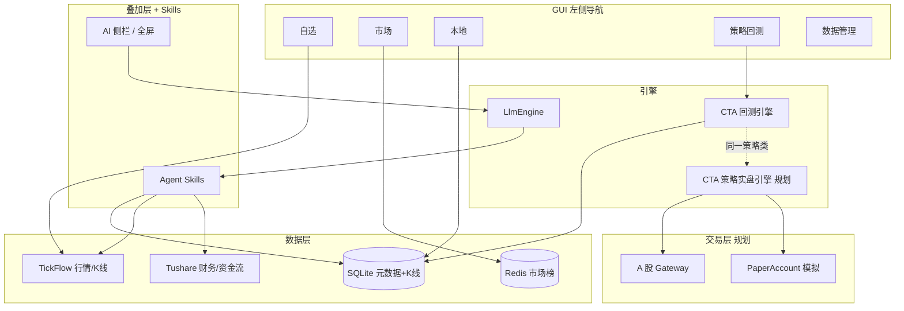

# A 股产品方案（回测 + 看盘 + AI + 选股 + 策略实盘）

本文档是 vnpy_zak 的**产品北极星**：专注 **A 股现货**，覆盖投研到实盘闭环；**不包含期货 CTP**。技术细节见 [architecture.md](./architecture.md)，策略实盘实现见 [roadmap.md](./roadmap.md) P3–P4。

---

## 1. 定位

**一句话**：个人 A 股量化终端 —— 选股 → 看盘 → 回测验证 → **同一套策略 A 股实盘** → AI 串联解读。

| 支柱 | 用户问题 | 核心能力 |
|------|----------|----------|
| **看盘** | 今天看什么、走得怎样 | 自选 / 市场 / 本地 K 线、五档、调度 |
| **回测** | 策略历史上行不行 | 策略回测 + `AShareTemplate`（T+1、整手） |
| **选股** | 从全市场筛出候选 | Tushare 因子 + 规则引擎 + 入自选 |
| **AI** | 自然语言问票、解图、解回测 | 上下文 + 工具调用（读行情/K 线/选股结果） |
| **策略实盘** | 策略能否自动跑 A 股 | A 股 Gateway + `AShareTemplate` + CTA策略模块（规划） |

### 策略生命周期（目标闭环）

```text
选股入池 → 看盘跟踪 → 策略回测验证 → 模拟盘（PaperAccount）→ A股策略实盘
         ↑_________________同一策略类（如 AshareDoubleMaStrategy）_________________↓
```

**当前阶段重心**：前四支柱（看盘 / 回测 / 选股 / AI）先打通投研闭环。  
**已确认远期目标**：支持 **A 股现货策略实盘**（非期货）；见下文 §10 与 roadmap P3。

**明确不做**：期货 CTP / SimNow、用 vnpy 默认 Trader 布局替换自建看盘页。

---

## 2. 总体架构



原则：**看盘与回测 UI 已自建；AI 通过 Agent Skills 读数据、不替代规则引擎；选股页与筛选引擎为规划中能力。**

---

## 3. 数据分工（最优且清晰）

| 数据 | 来源 | 用途 |
|------|------|------|
| 实时/历史行情、日分钟 K | **TickFlow** | 看盘、下 K、回测主数据 |
| 财务、资金流、估值、行业 | **Tushare** | 选股因子（非 GUI 主行情） |
| 自选池、全市场列表、选股结果 | **SQLite** `~/.vntrader/vnpy_zak.db` | 元数据 |
| 本地 K 线 | **SQLite** `database.db` | 回测、本地页 |
| 涨幅榜快照 | **Redis** + collector | 市场页（可选，非核心路径） |

避免让 AI 或选股模块直接「编造」行情；数值一律来自上述数据源。

---

## 4. 四支柱最优路径

### 4.1 看盘（已实现，维护增强）

**现状**：自选 TickFlow、市场 Redis、图表/五档/调度 —— 已是正确方向。

**当前状态**：

- [x] 自选页直连 TickFlow 行情
- [x] 市场页 Redis 涨幅榜 + TickFlow 直连刷新（`TickFlowStreamBridge`）
- [x] 分K 图表（1分/5分/日K）
- [x] 五档盘口（TickFlow WS）
- [x] 定时刷新调度（`refresh_scheduler`）
- [ ] 自选页工具栏「AI」图标（等同 `Ctrl+L`）
- [ ] 状态栏显示行情源（TickFlow / Redis）

**实盘阶段**：看盘可切换为 Gateway 行情主源（roadmap P4），与策略下单同源。

---

### 4.2 回测（深化 A 股，不扩期货）

**现状**：`AshareDoubleMaStrategy` + 策略回测页 + 自动 A 股默认参数；Widget 过滤仅展示 `AShareTemplate` 子类。

**交互与数据分阶段规格**：见 [backtest-ux.md](./backtest-ux.md)。

**下一步**：

| 优先级 | 项 | 说明 |
|--------|-----|------|
| **B1** | **看盘 → 策略回测联动** | 自选/市场/本地选中标的，一键跳转并预填代码（见 backtest-ux §B1） |
| B2 | 自选池批量回测 | 对 watchlist 逐只跑同一策略，输出对比表 |
| B3 | 回测结果摘要 | 收益、回撤、夏普落库，供 AI `get_backtest_summary` |
| B4 | 回测页 AI 上下文 | 侧栏知晓当前回测标的与最近结果 |
| P2 | 更多 `AShareTemplate` 示例策略 | 突破、RSI 等，仍只做多 |
| B5 | 分钟回测 | 依赖 TickFlow 分钟 K 本地量 |

**与实盘关系**：回测通过的 `AShareTemplate` 子类，**直接作为** CTA策略模块的实盘策略类（vnpy「CTA」为框架名，非期货专用）。实盘能力在 **迭代 4 / roadmap P3** 落地。

---

### 4.3 选股（规划中，为四大支柱的缺口）

选股是四支柱里**缺口最大**的一块，规划独立成左侧导航 **「选股」** 页（与市场「发现」、自选「跟踪」区分）。**当前尚未实现**，选股能力暂时通过 Agent Skill `vnpy_screening_skill.py` 提供 CLI 级筛选。

#### 分层设计

```text
Layer 1  规则引擎（确定性）
         Tushare 拉表 → pandas 筛选 → 结果列表
Layer 2  模板 / 保存方案
         预置：低 PE、高 ROE、主力净流入、行业龙头等
Layer 3  AI 增强（可选）
         自然语言 → 解析为规则参数（人工确认后执行）
         对结果集生成文字点评（不替代筛选）
```

#### 推荐模块结构（尚未创建）

```text
vnpy_ashare/screener/
├── factors.py      # Tushare 字段封装
├── rules.py        # 可组合筛选条件
├── runner.py       # 执行选股、写 DB
└── presets.py      # 内置方案

vnpy_ashare/ui/screener_page.py   # 选股页 GUI
scripts/run_screener.py           # CLI，便于定时任务
```

#### 与用户流程

```text
选股页设定条件 → 运行 → 结果表（代码/名称/关键因子）
    → 勾选 → 加入自选
    → 选中 → 跳转自选看盘 / 问 AI
    → 可选：对结果批量下载日 K → CTA 回测
```

#### 数据依赖

- `.env` 中 `TUSHARE_TOKEN`（已有占位）
- 全市场列表：`sync_universe` 已有，选股结果与之 join

---

### 4.4 AI 增强（服务三业，而非第四套 UI）

**现状**：侧栏 Dock、全屏、`vnpy_llm` 插件化。**Agent Skills** 体系已落地：通过 `vnpy_skills/` 引擎注册业务 Skill，每个 Skill 以 `SkillTemplate` 子类暴露工具函数供 LLM 调用。

**核心 Skill：**

| Skill 文件 | 能力 |
|------------|------|
| `skills/vnpy_context_skill.py` | 终端上下文（当前自选、K 线概览） |
| `skills/vnpy_data_skill.py` | 行情/K 线数据查询 |
| `skills/vnpy_backtest_skill.py` | 回测执行与结果读取 |
| `skills/vnpy_screening_skill.py` | 选股筛选（CLI 级） |
| `skills/vnpy_watchlist_skill.py` | 自选池管理 |

**工具调用（由 Agent Skills 提供）：**

| 工具 | 作用 |
|------|------|
| `get_quote_context` | 当前选中标的行情摘要（通过 `set_ai_context` 共享） |
| `get_bars_summary` | 本地 K 线条数、区间涨跌 |
| `get_watchlist` | 自选列表 |
| `run_screener` | 执行已保存选股方案，返回 Top N |
| `get_backtest_summary` | 最近一次回测指标 |

交互示例：

- 看盘时：「这只票最近 20 日形态如何？」→ 读 K 线摘要回答
- 选股后：「筛出的 30 只里哪些偏银行？」→ 读选股结果 + 行业字段
- 回测后：「和大盘比怎么样？」→ 读回测摘要（需先落地回测摘要存储）

**原则**：

- LLM **不执行**买卖建议；**不编造**价格
- 选股 **默认走规则引擎**；AI 可建议条件，用户确认后再跑

---

## 5. 左侧导航（当前态）

```text
自选 | 市场 | 本地 | 策略回测 | 数据管理
（规划：选股页 + CTA策略页 待后续迭代加入）
```

| 页 | 心智 |
|----|------|
| 自选 | 我的池子，深度跟踪 |
| 市场 | 全市场发现、涨幅榜 |
| 本地 | 已下载 K 线健康状态 |
| 策略回测 | 历史验证策略 |
| 数据管理 | vnpy 数据维护 |

**选股** 页（未实现）：规划为规则筛选 + 导入自选。  
**CTA策略** 页（vnpy `CtaManager`）：**当前未挂载**（`launcher` 不加载 `CtaStrategyApp`），P3 接入 A 股 Gateway 时恢复。

AI：**不进主导航**，保持 `Ctrl+L` / `⌘L` 叠加层（方案 B）。

---

## 6. 实施优先级（分 4 个迭代，当前处于迭代 2–3 之间）

### 迭代 1：选股 MVP（待开始）

1. `screener` 包 + CLI：`scripts/run_screener.py`
2. 2–3 个预置方案（如：市值 > X、PE < Y、近 5 日资金流）
3. 结果写入 DB / 导出 CSV，脚本 `加入自选`
4. `.env` / README 补充 Tushare 说明

### 迭代 2：选股 GUI + 回测联动（部分完成）

1. ~~左侧「选股」页：条件表单 + 结果表 + 加入自选~~（待开始）
2. **✅ 看盘 → 策略回测联动**（B1 已完成）
3. 回测结果摘要落库（B3 待开始）

### 迭代 3：AI 工具链（Agent Skills 已落地）

1. **✅ Agent Skills 体系**（`vnpy_skills/` 引擎 + 5 个业务 Skill）
2. **✅ AI 可读上下文**（`session_context.py`：行情/K 线/回测摘要共享）
3. 可选：自然语言 → 选股参数（需确认框）

### 迭代 4：A 股策略实盘（roadmap P3–P4，待开始）

1. 接入 **A 股 Gateway**（XTP / 华鑫奇点 / OST 等，按券商选型），`launcher` 注册 `add_gateway`
2. **PaperAccount** 本地模拟：Gateway 行情 + 本地撮合，验证策略再实盘
3. 交易 Dock（`TradingWidget`）+ 左侧「交易监控」页；看盘页选股 → 填合约
4. **CTA策略** 页：加载与回测相同的 `AShareTemplate` 策略，初始化 → 启动
5. `GatewayQuoteProvider`：实盘模式下看盘与策略共用券商 Tick（P4）

---

## 7. 技术约束（保持简单）

1. **一套 A 股模型**：继续 `StockItem` + `QuoteSnapshot`，不引入期货合约逻辑  
2. **策略只做多**：`AShareTemplate` 统一 T+1、100 股  
3. **选股可复现**：条件 JSON 存盘，同条件同结果  
4. **AI 可审计**：工具调用打日志，回答引用数据来源  
5. **包边界**：`vnpy_llm` 通用；`vnpy_skills` 为 AI 工具引擎；`vnpy_mcp` 为远端工具集成  

---

## 8. 成功标准

### 阶段 A（投研闭环，迭代 1–3）

- [ ] 用户用 **选股页** 从全市场筛出列表并 **一键入自选**  
- [ ] 自选标的 **批量回测** 同一策略并对比  
- [ ] 看盘时 **AI** 能基于 **真实行情/K 线摘要** 回答，无幻觉价格  

### 阶段 B（策略实盘，迭代 4）

- [ ] 回测通过的 `AShareTemplate` 策略可在 **CTA策略** 页加载运行  
- [ ] **PaperAccount** 下完成至少一次模拟盘自动交易闭环  
- [ ] 接入目标券商 **A 股 Gateway** 后，支持实盘或券商仿真账号  
- [ ] 实盘时策略行情与下单 **同源**（Gateway Tick）  

---

## 9. A 股策略实盘要点（非期货）

| 项 | 说明 |
|----|------|
| 接口 | A 股现货 Gateway，**不是** CTP / SimNow |
| 策略 | `vnpy_ctastrategy` + `AShareTemplate`（T+1、100 股、只做多） |
| 模拟 | `vnpy_paperaccount` + Gateway 行情，本地撮合 |
| UI | 增量叠加：交易 Dock + CTA策略页 + 交易监控页，不替换看盘页 |
| 行情 | 研究：TickFlow；实盘：Gateway 优先（TickFlow 降级备用） |

---

## 10. 与 roadmap 的对应

| 文档阶段 | 内容 |
|----------|------|
| 迭代 1–3（product-plan） | 选股、批量回测、AI Agent Skills |
| P3（roadmap） | A 股 Gateway、PaperAccount、CTA策略实盘、交易 Dock |
| P4（roadmap） | 看盘页 `GatewayQuoteProvider`，与策略行情同源 |
| 不在范围 | 期货 CTP、默认 Trader 全屏布局 |

投研闭环（看盘 + 回测 + AI Skills）已基本可用；**选股 GUI 与策略实盘为规划的后续迭代**，与回测共用同一套 A 股策略代码。
